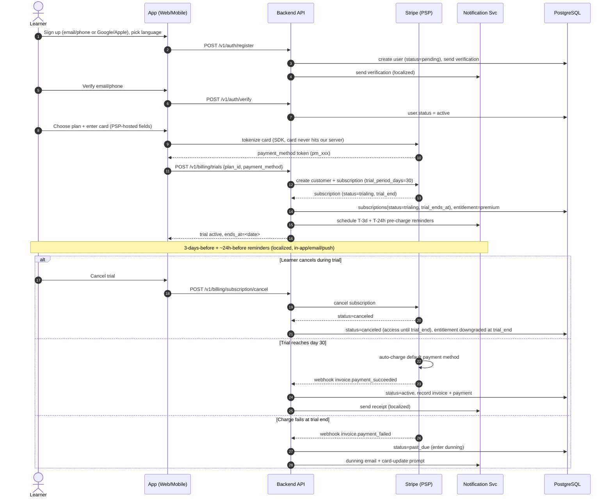
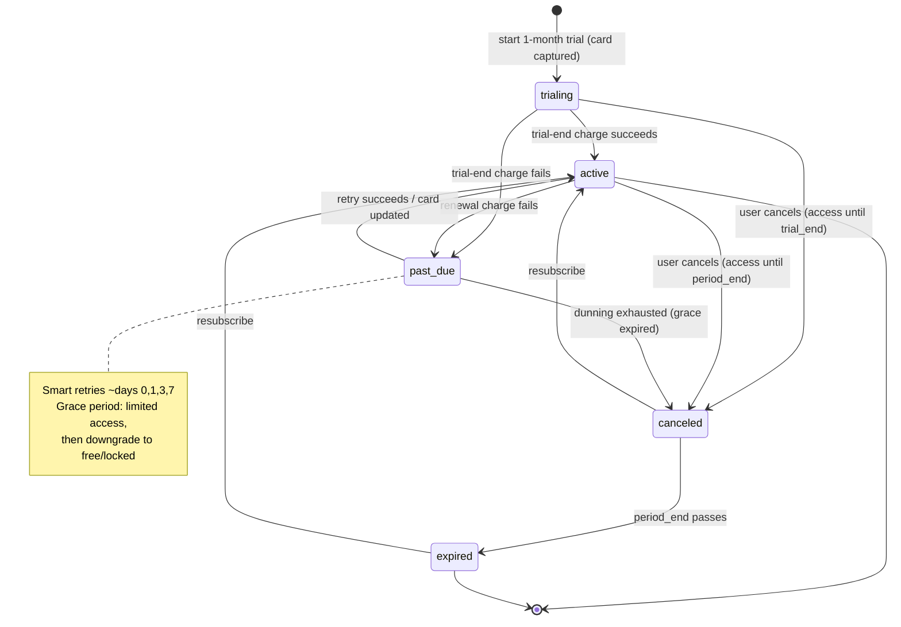
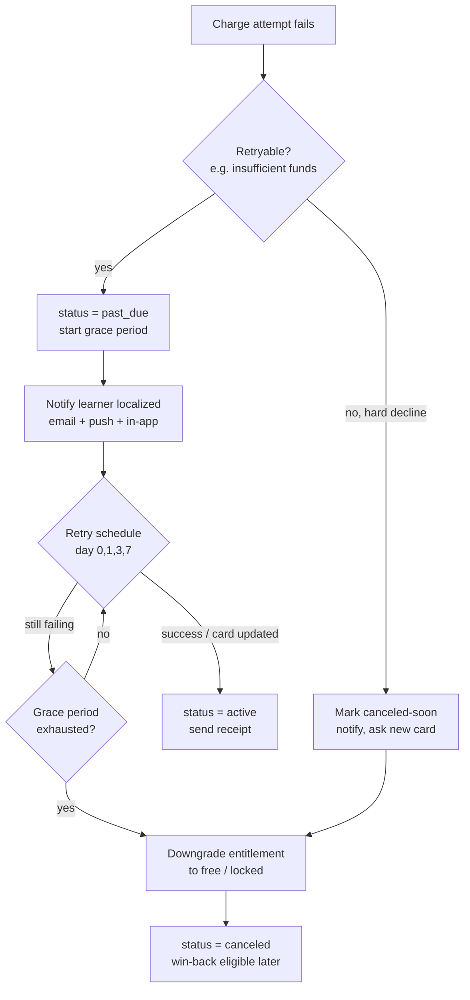
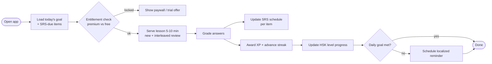
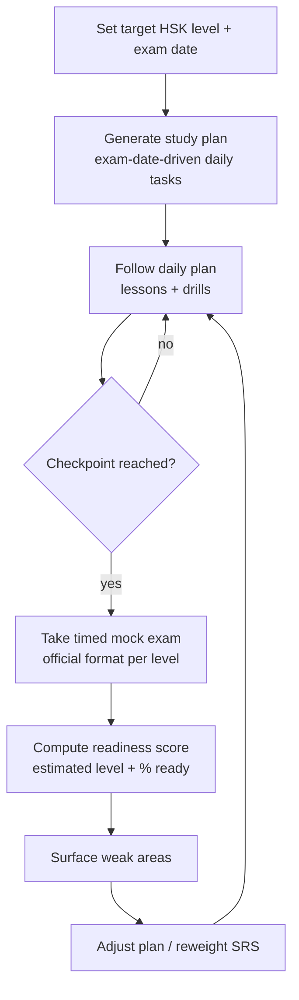
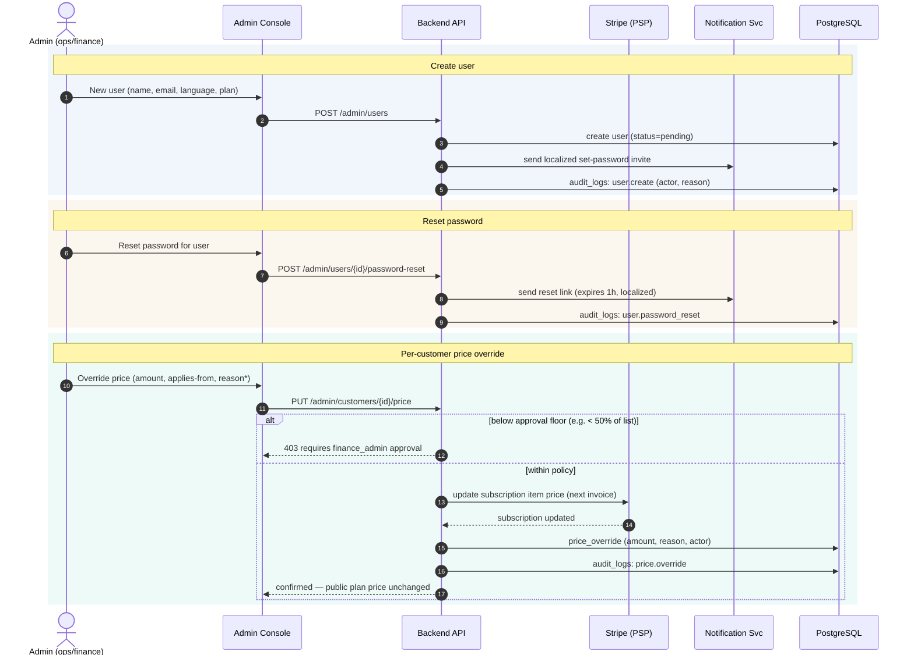
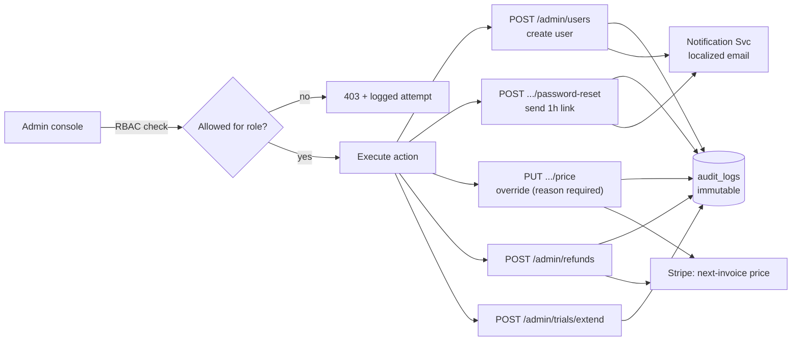
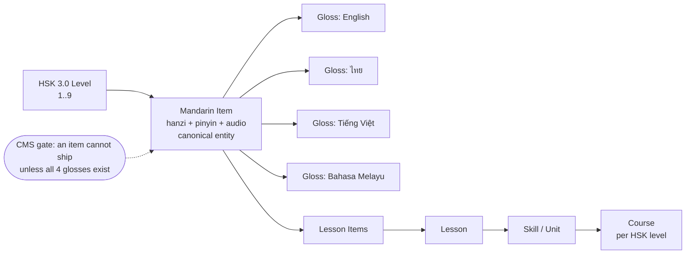

# MandaMix — Architecture & Workflow Diagrams

> Companion to `MandaMix_PRD.pdf`. All diagrams use [Mermaid](https://mermaid.js.org/)
> and render natively on GitHub, in VS Code (Markdown Preview Mermaid extension), and
> in JetBrains IDEs. Paste any block into <https://mermaid.live> to edit visually.

Assumed stack (see `.env.example` and `docs/03_api.md`):

- **Frontend:** React Native (iOS/Android) + responsive React web, sharing an i18n catalog.
- **Backend:** Node/TypeScript REST API (`/v1`), PostgreSQL, Redis (cache + job queue).
- **Payments:** Stripe (PCI-compliant PSP) — tokenized cards, subscriptions, webhooks.
- **Infra:** S3 + CDN for native Mandarin audio, object storage for media; container-hosted API.

---

## 1. System Architecture (C4-ish container view)

```mermaid
graph TB
    subgraph Clients
        MOB["Mobile App<br/>(React Native — iOS/Android)"]
        WEB["Web App<br/>(React, responsive)"]
        CMS["Content CMS<br/>(internal authoring/translation)"]
        ADM["Billing & Ops Admin"]
    end

    CDN["CDN<br/>(Mandarin audio, media, static)"]
    APIGW["API Gateway / Load Balancer<br/>(TLS, rate limiting, WAF)"]

    subgraph Backend["Backend Services (REST /v1)"]
        AUTH["Auth Service<br/>(JWT, OAuth, sessions)"]
        BILL["Billing Service<br/>(trials, subscriptions, dunning)"]
        LEARN["Learning Service<br/>(courses, lessons, progress)"]
        SRS["SRS Engine<br/>(scheduling, review queue)"]
        EXAM["HSK Prep Service<br/>(mock exams, readiness, study plans)"]
        ENT["Entitlement Service<br/>(access checks)"]
        NOTIF["Notification Service<br/>(email/push, reminders)"]
        CONTENT["Content Service<br/>(items, glosses, i18n)"]
        ANALYTICS["Analytics/Event Ingest"]
    end

    subgraph Data
        PG[("PostgreSQL<br/>(primary store)")]
        REDIS[("Redis<br/>(cache, queues, rate limit)")]
        OBJ[("Object Storage / S3<br/>(audio, exports)")]
        DW[("Data Warehouse<br/>(analytics, optional)")]
    end

    subgraph External["Third-party"]
        STRIPE["Stripe<br/>(PSP / webhooks)"]
        EMAIL["Email Provider<br/>(Postmark/SendGrid)"]
        PUSH["Push (FCM / APNs)"]
        OAUTHP["Google / Apple OAuth"]
        SPEECH["Speech / Pronunciation API (P1)"]
        STORE["App Store / Play Billing"]
    end

    MOB & WEB --> CDN
    MOB & WEB & CMS & ADM --> APIGW
    APIGW --> AUTH & BILL & LEARN & SRS & EXAM & ENT & NOTIF & CONTENT & ANALYTICS

    AUTH --> OAUTHP
    BILL <--> STRIPE
    BILL --> STORE
    NOTIF --> EMAIL & PUSH
    EXAM --> SPEECH
    LEARN & SRS --> SPEECH

    AUTH & BILL & LEARN & SRS & EXAM & ENT & NOTIF & CONTENT --> PG
    AUTH & SRS & NOTIF & BILL --> REDIS
    CONTENT --> OBJ
    ANALYTICS --> DW
    CDN --> OBJ
```

---

## 2. Registration → 1-Month Trial → Conversion (sequence)

---

## 3. Subscription Lifecycle (state machine)

---

## 4. Dunning / Failed-Payment Flow

---

## 5. Daily Learning Loop

---

## 6. HSK Prep Loop (Persona B)

---

## 7. Admin Console Operations

Admin actions are RBAC-gated and every mutation is written to an immutable
`audit_logs` entry. Admins never see or set passwords — account creation and
resets work through expiring, localized links.

### Admin action ↔ audit flow (overview)

---

## 8. Content & Localization Model (logical)

