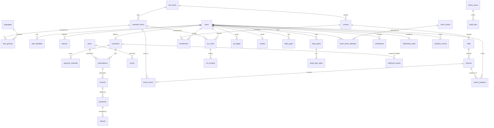

# MandaMix — Database Design

> Engine: **PostgreSQL 15+**. Runnable DDL in [`db/schema.sql`](../db/schema.sql).
> IDs are UUIDs. All timestamps are `timestamptz` (UTC). Money is stored in **minor units**
> (integer cents) + ISO-4217 currency to avoid float errors. Soft-deletes via `deleted_at`
> where relevant.

## Design principles

1. **Mandarin item is the canonical entity.** Every learnable item carries exactly four
   localized glosses (EN/TH/VI/MS); the CMS enforces "no item ships without all four"
   (`item_glosses` + a completeness check).
2. **Server is the source of truth for entitlement.** Subscription state drives access;
   never trust the client. Stripe webhooks mutate billing state idempotently
   (`webhook_events` dedupe).
3. **PCI scope stays minimal.** We store only PSP tokens + card metadata
   (`brand`, `last4`, `exp`), never PANs.
4. **Right-to-grow localization.** Adding Bahasa Indonesia/Khmer = new row in `languages`
   + new gloss rows; no schema change.

## Entity-Relationship Diagram

## Table groups

| Group | Tables |
|---|---|
| Identity & auth | `users`, `auth_identities`, `devices`, `sessions` |
| Billing | `customers`, `plans`, `prices`, `subscriptions`, `payment_methods`, `invoices`, `payments`, `refunds`, `webhook_events` |
| Content | `languages`, `hsk_levels`, `mandarin_items`, `item_glosses`, `courses`, `skills`, `lessons`, `lesson_items` |
| Learning & progress | `enrollments`, `lesson_progress`, `srs_cards`, `srs_reviews`, `xp_ledger`, `streaks`, `daily_goals` |
| HSK prep | `mock_exams`, `mock_exam_attempts`, `readiness_scores`, `study_plans`, `study_plan_tasks` |
| Engagement | `notifications`, `notification_prefs` |
| Ops & analytics | `admin_users`, `audit_logs`, `analytics_events` |

## Key invariants & indexes

- `subscriptions.status ∈ {trialing, active, past_due, canceled, expired}` — single active
  (non-terminal) subscription per customer enforced by a partial unique index.
- `item_glosses (item_id, language_code)` unique; a publish check requires one row per
  `languages.is_learner_facing = true`.
- `webhook_events.provider_event_id` unique → idempotent webhook processing.
- Hot read paths indexed: `srs_cards(user_id, due_at)`, `lesson_progress(user_id, lesson_id)`,
  `notifications(user_id, status, send_at)`, `invoices(subscription_id, created_at)`.
- Money columns are `integer` (minor units) paired with `currency char(3)`.
- Per-customer price overrides live on `subscriptions` (`override_amount_minor`,
  `override_reason`, `override_cycles_left`, nullable) — the public `prices` rows are
  never mutated by admin actions. Every override, refund, trial extension, admin user
  creation, and password reset writes an `audit_logs` row (immutable, actor + reason).
